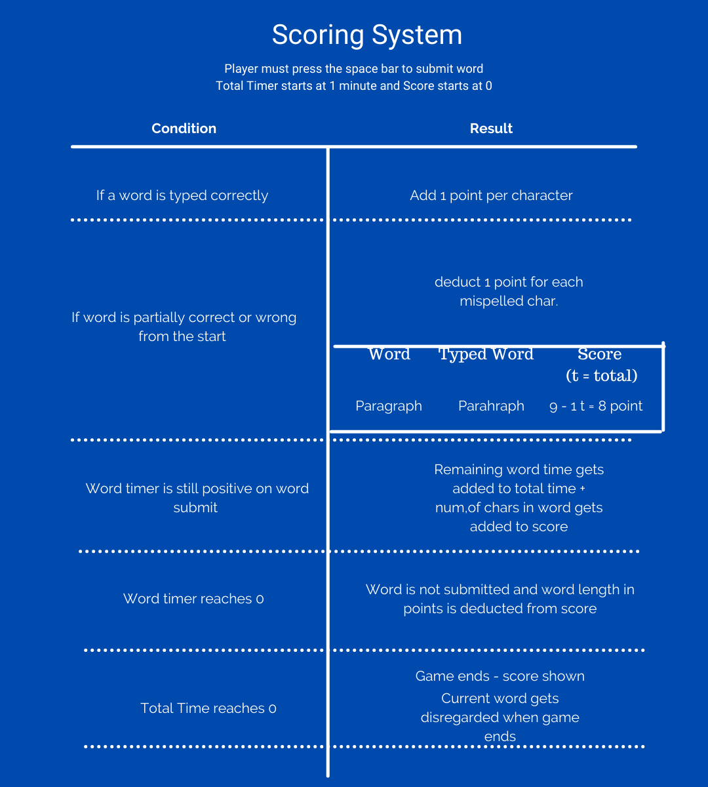
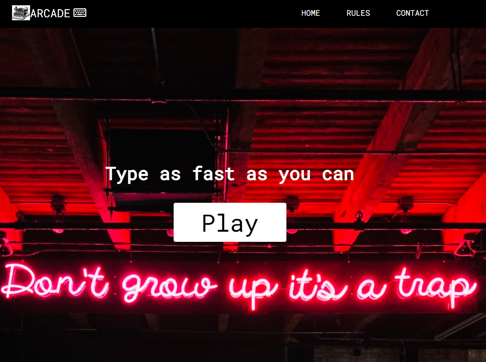
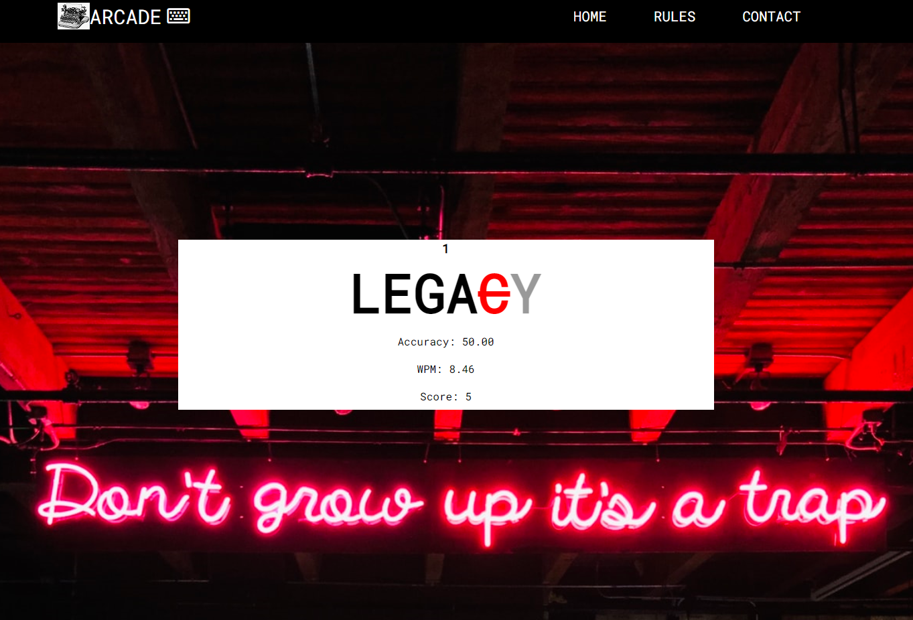
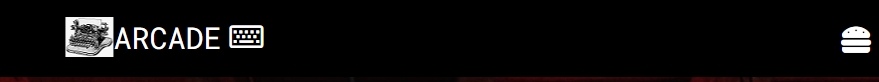
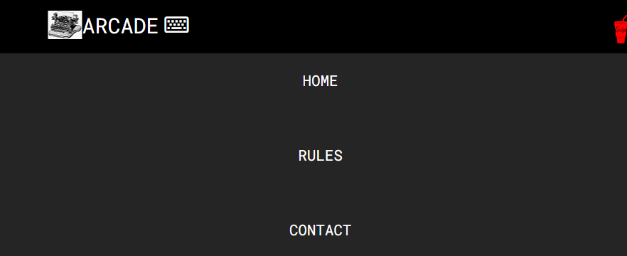
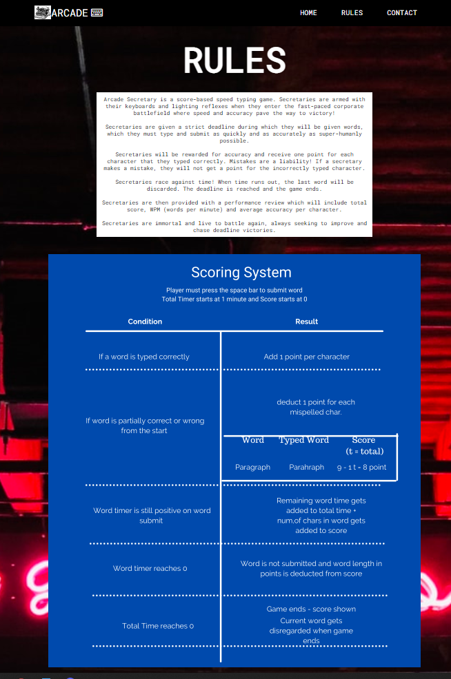
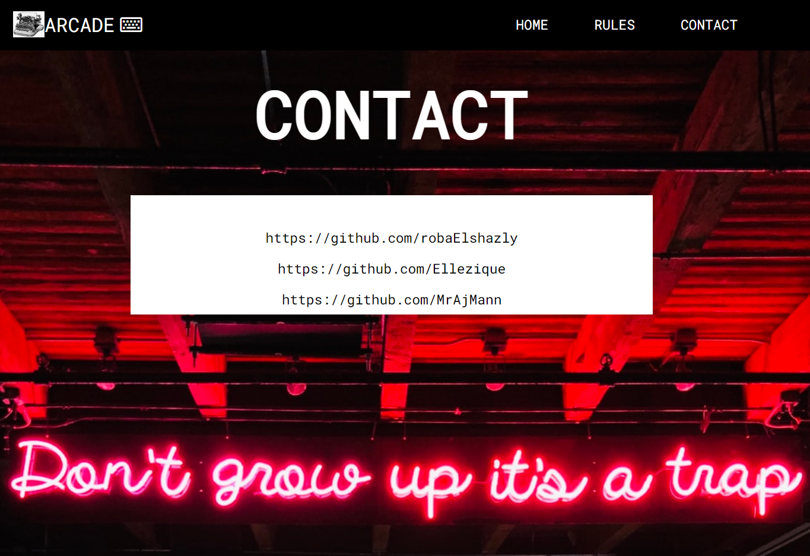
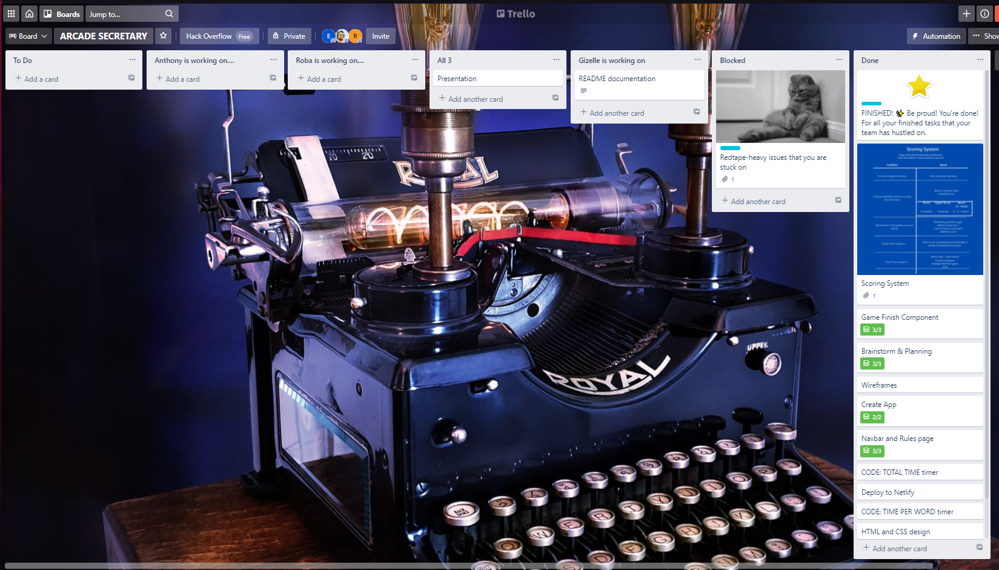

# ARCADE SECRETARY
#### TEAM: HACK OVERFLOW
#### Members: Roba, Gizelle, Anthony

--------

#### Game Description 
Arcade Secretary is a score-based speed typing game. Secretaries are armed with their keyboards and lighting reflexes when they enter the fast-paced corporate battlefield where speed and accuracy pave the way to victory!

Secretaries are given a strict deadline during which they will be
given words, which they must type and submit as quickly and as
accurately as super-humanly possible.

Secretaries will be rewarded for accuracy and receive one point for
each character that they typed correctly. Mistakes are a liability!
If a secretary makes a mistake, they will not get a point for the
incorrectly typed character.

Secretaries race against time! When time runs out, the last word will be discarded. The deadline is reached and the game ends. 

Secretaries are then provided with a performance review which will
include total score, WPM (words per minute) and
average accuracy per character.

Secretaries are immortal and live to battle again, always seeking to
improve and chase deadline victories.
#### Rules 

#### Play
Arcade Secretary has been deployed on Netlify. You may play the game online.

#### Download
You may also download the source code and play in development mode.
1. Make a fork of this repository.
2. Clone your fork to your local development environment.
3. Change to the project directory.
4. Install dependencies: 
`$ yarn install`
5. Run the application: 
`$ yarn start` 
Runs the app in the development mode.Open [http://localhost:3000](http://localhost:3000) to view it in the browser.You are ready to play!
#### Screenshots

#### Thanks
[Trello](https://trello.com/) was used for task management throughout this project.

The background image is by Tyler Callahan and is available on [Unsplash](https://unsplash.com/photos/r0UNLHW_P58).

